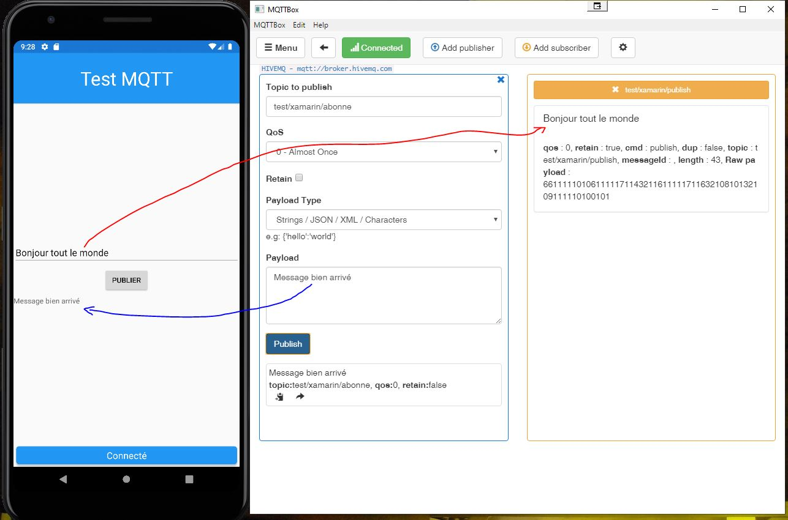

# Application de test pour MQTT avec Xamarin Forms

Cette application permet de saisir un texte et de le publier sur le topic 
`test/xamarin/publish`. (flèche rouge  dans l'image ci-dessous). L'application est abonnée au topic `test/xamarin/abonne`
et affiche le message reçu dans un label (flèche bleue).
[ *à gauche l'application, à droite un client windows 
publiant sur test/xamarin/abonne et abonné à test/xamarin/publish*
 
Le bandeau bleu en bas de l'application indique que l'application est connecté au broker (broker.hivemq.com pour l'exemple)

